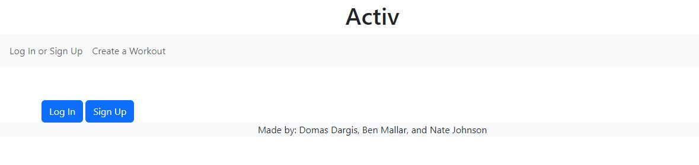

# Activ

## Description
Activ is a workout tracking and sharing application that allows users to track past workouts, view other users’ workouts for inspiration, and share accomplishments to their friends.  The application has two major functions: first, Activ is meant to be an educational resource for athletes of any level to learn  more about exercises they already do or discover new exercises that they might like.  This information comes from API Ninjas “Exercises” that provides pretty detailed descriptions from a large database of exercises.  Second, Activ is meant to serve as a social media platform through which friends can connect and celebrate the progress that they make.

## Installation
No installation necessary, the application can be accessed at the following link: 
[Activ Render Deployment](https://activ.onrender.com/)

## Usage
Upon running the application, this is a screenshot of what the landing page will look like:

Before logging in, a user will be able to look at only this page and the page to create a workout.  To login, click the button in the top right of the screen.  You will be prompted to either provide an existing username and password or sign up with new credentials.  Once you have logged in or created an account, you will have access to the various other pages where you can look at all of your workouts, all other users on the application, their profiles, their workout histories, or some premade workouts for inspiration.

If at any point the user would like to log out, they can simply click the log out button in the nav bar.

## Contributing
N/A

## Tests
N/A

## Credits
This application was created by Ben Mallar, Nate Johnson, and Domas Dargis
